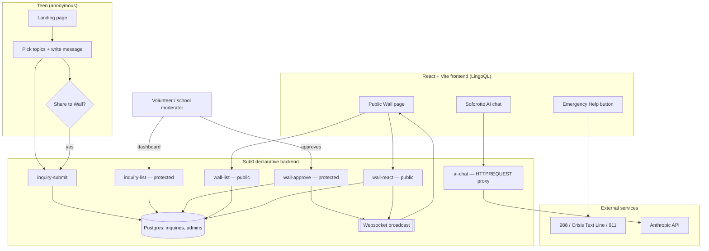

# Soforotto — Anonymous peer-support infrastructure for schools and youth orgs

Built for the **Zero to Query: LingoQL Hackathon** (powered by LingoQL + Sub0).

## The problem

Most teens don't have someone easy to talk to about everyday stuff — school
stress, friend drama, family conflict, being bullied — that isn't a parent, a
teacher, or a scheduled therapy appointment. A lot of them also won't reach
out at all if it means giving up their name, email, or any trace back to
them; the fear of being "found out" is often bigger than the problem itself.

Schools, districts, and youth nonprofits already know this gap exists — it's
why "anonymous suggestion box" and tip-line tools exist in some form almost
everywhere. Most of what's out there is either a static form that disappears
into a shared inbox, or expensive enterprise software built for adults, not
teens.

## The product

Soforotto is a white-label anonymous intake and peer-support platform. A
teen picks what's going on (School, Friends & Bullying, Family, Something
else), writes as much or as little as they want, and submits it — with no
name, email, or account required. A moderation team (school counselors,
trained volunteers, or a youth org's own staff) signs into a protected
dashboard, reads incoming messages, and responds if the teen left a way to
reach them. Approved, anonymized messages can also surface on a public
"Wall" so teens facing the same thing can see they're not alone and react
with light, preset support — deliberately not open chat between strangers,
which is a real safety risk with minors.

This isn't a crisis line — the product is explicit that emergencies should
go to real emergency services or a crisis hotline (988 in the US), with an
in-product button that does exactly that. It's built for the much larger,
unaddressed category of "I just need someone to talk to," which sits
underneath and around any crisis-line deployment a school already has.

**Business model:** the live site in this repo is the free, consumer-facing
demo instance. The actual product is licensed per-school or per-district —
schools get their own branded instance, their own moderation team and
dashboard, and Sub0/LingoQL infrastructure isolated to their data. That's the
same core codebase serving both a public-good use case and a monetizable
vertical-SaaS deployment, without changing a single feature.

## Trust & safety model

- Every volunteer/moderator completes screening and crisis-response training
  before they get dashboard access.
- Messages are checked multiple times a day; if nothing's heard back within
  24 hours, the product tells the teen to use the emergency button instead
  of waiting.
- Anything showing signs of real risk gets flagged for professional
  referral — it doesn't sit with one volunteer to handle alone.
- Privacy claims on the site are scoped to what the product actually
  controls: no name/account is ever required, and email is only stored if a
  teen chooses to leave one. It does not claim to control infrastructure-level
  logging on Sub0/LingoQL's side, because that's not something this repo can
  verify or promise.

## Architecture



Key design choices the diagram doesn't show on its own:

- **Anonymity is enforced at the schema level**, not just the UI — `name`
  and `email` are explicitly `optional` on the `_inquiry` model, and
  `inquiry-submit` never requires them.
- **The AI API key never reaches the browser.** `ai-chat` is a Sub0
  `HTTPREQUEST` actionable that injects `$ENV.ANTHROPIC_API_KEY` server-side
  and proxies to Anthropic — the frontend only ever talks to Sub0.
- **The Wall is public but never traceable to a submitter** — `wall-list`
  only ever returns `id`, `services`, `message`, `reactions`, `created_at`.
  Name/email columns are never in that query, structurally, not just by
  convention.

## Tech stack

- **Frontend:** React 19, TypeScript, Vite, Tailwind CSS v4, Motion
  (`motion/react`), React Router, lucide-react.
- **Backend:** [Sub0](https://docs.lingoql.com/sub0/introduction) — declarative
  JSON models + API definitions, no hand-written server code.
- **Deployment:** [LingoQL](https://lingoql.com) — frontend as a static/Vite
  build, Sub0 backend and its Postgres database as managed services.

## How Sub0 is used

All backend logic lives in [`sub0/`](sub0) as declarative JSON — no imperative
server code:

| File | Purpose |
|---|---|
| `sub0/models/_inquiry.json` | Data model for an incoming message (optional name/email, selected topics, message, status, wall status, reactions, timestamps). Name and email are explicitly `optional` — anonymity is enforced at the schema level, not just in the UI. |
| `sub0/models/_admin.json` | Data model for volunteer/moderator accounts. |
| `sub0/apis/inquiry-submit.json` | Public endpoint. Validates only the topics and message (name/email are never required), inserts with a generated KSUID id. |
| `sub0/apis/admin-sign-up.json` | Creates a moderator account; hashes the password with bcrypt (`hashables`). **Run once to create your account, then remove or protect this file before going live** — it has no auth gate of its own. |
| `sub0/apis/admin-sign-in.json` | Verifies the bcrypt hash (`verify_hashables`) and issues a JWT. |
| `sub0/apis/inquiry-list.json` | Protected endpoint (`protected` + JWT) — lists all messages, newest first. |
| `sub0/apis/inquiry-update-status.json` | Protected endpoint — updates a message's triage status. |
| `sub0/apis/wall-list.json` | Public endpoint — returns only anonymized fields for approved Wall posts. |
| `sub0/apis/wall-approve.json` | Protected endpoint — moderator approves a pending post; broadcasts a websocket update so the Wall refreshes live. |
| `sub0/apis/wall-react.json` | Public endpoint — atomically increments a preset reaction count; also broadcasts live. |
| `sub0/apis/ai-chat.json` | Public endpoint using a Sub0 `HTTPREQUEST` actionable to proxy to Anthropic's API, keeping the API key server-side. |

## How LingoQL is used

- The Vite frontend build is deployed as a static/Node app on LingoQL
  (auto-detected via Railpack/Nixpacks).
- The Sub0 backend and its Postgres database run as managed services on
  LingoQL, giving the frontend a stable `https://api.<project>.lingoql.com`
  base URL.

See [`DEPLOY.md`](DEPLOY.md) for exact steps.

## Local development

```bash
cd frontend
npm install
cp .env.example .env      # point VITE_SUB0_API_BASE at your Sub0 project's API URL
npm run dev
```

The Sub0 side isn't run locally — model/API JSON files are pushed to your
Sub0 project (see DEPLOY.md), which provisions the database and generates the
live endpoints.

## Project structure

```
mainframe-studio-crm/
├── frontend/            React + Tailwind + Motion app
│   └── src/
│       ├── components/  Navbar, Hero, TrustSection, ServicePills, InquiryForm,
│       │                InfoSections, AIChat, EmergencyHelp
│       ├── pages/       Landing, Wall, AdminLogin, AdminDashboard
│       └── lib/api.ts   Sub0 API client
├── sub0/
│   ├── models/           Declarative data models
│   └── apis/             Declarative API/ABI endpoint definitions
├── DEPLOY.md             Step-by-step LingoQL + Sub0 deployment guide
└── DEMO_SCRIPT.md        Outline for the 3–5 minute demo video
```

## Team

Solo build (max team size for this hackathon is 4).
